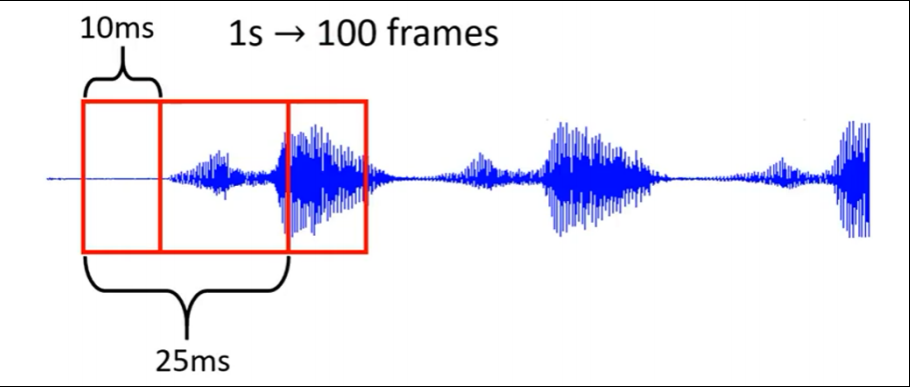
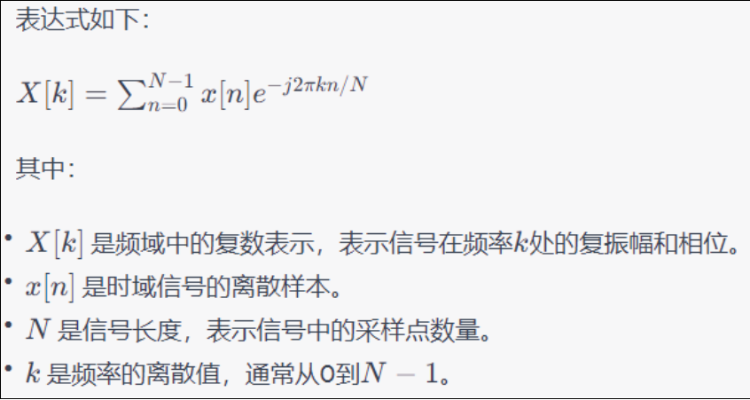
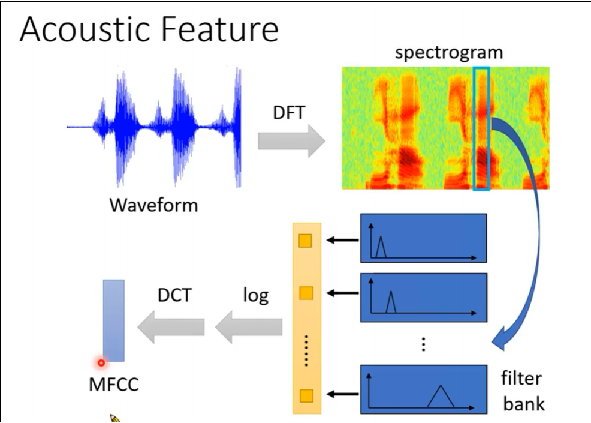
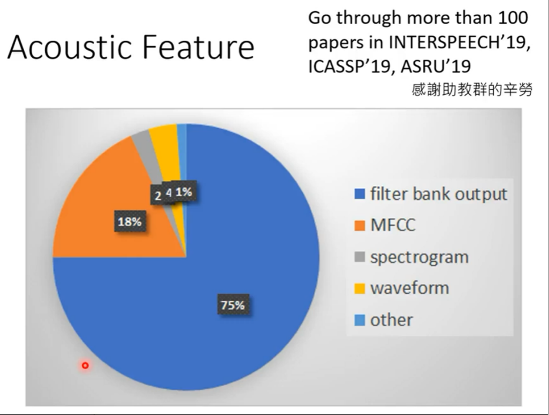
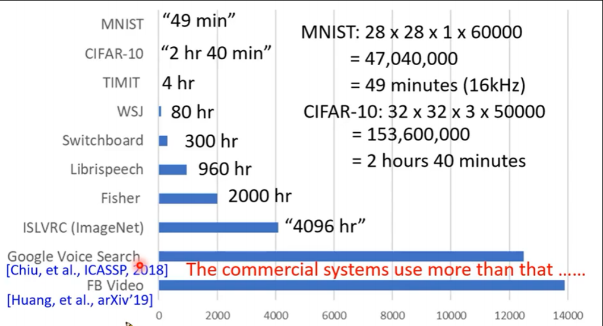
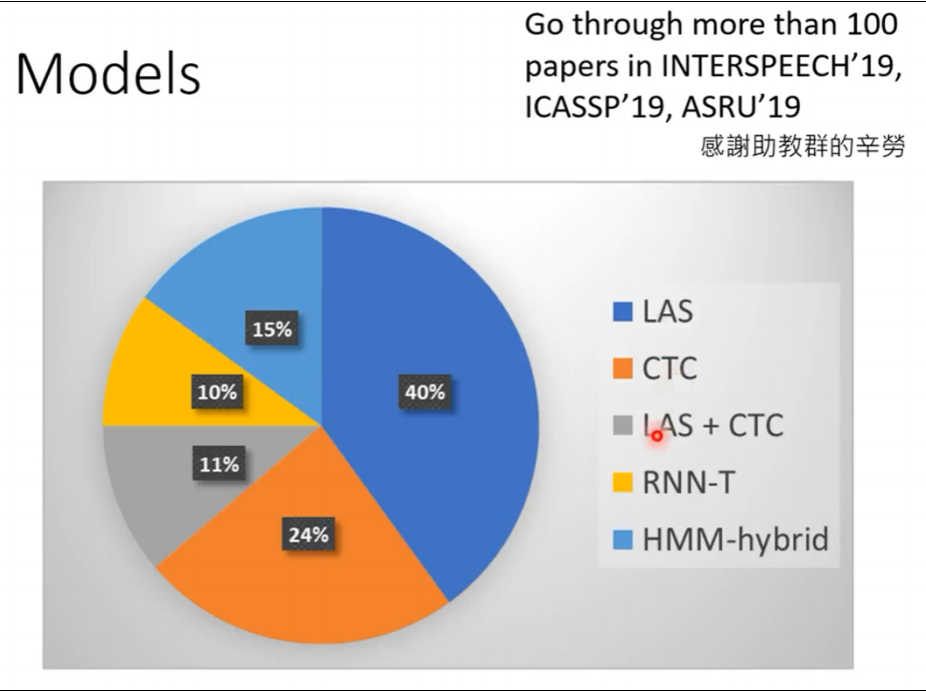

# 课程一：初见Speech Recognition
语音模型：即将 **sound** 转换成 **text**

* **Text:** a sequence of Token
  * 长度：**N** ， 总种类数量：**V**
* **Sound:** vectors sequence
  * 长度：**T** ， 总种类数量：**d**
---

## 一、Text Token
**种类**
1. Phoneme：即 a unit of sound，可以理解为发音的音标
2. Grapheme：即 smallest unit of a writting，比如【26个英文字母+空格+标点符号】
3. Word：即语言中的单词
4. Morpheme：即 smallest meaningful unit，比如英语单词的词根
5. Bytes：直接用字节表示一组Text，常见的诸如 UTF-8 编码
   
**大家用的（大趋势）**

最多的是grapheme，这种非常简单直接。

## 二、模型（Speech Recognition）功能
1. 输出 word embeddings
2. 模型中加入 Translation，输出识别后翻译的结果
3. 模型中加入 Intent classification，输出语音的分类，理解对方意图
4. 模型中加入 Slot filling，即输出一段语句的关键词，如时间、地点等
---

## 三、声音特征 Acoustic Feature
通常以 25ms 为窗口长度，将声音讯号转为 一个向量（**frame**，也即帧），每次窗口移动 10ms，也就
是说 1s →100 frames

**frame 制作方法**
1. sample points：当 **声音采样率** 在 16KHz 时，其在 25ms 内一共有 400个 sample points，直接
将这400个数字拿过来当frame即可
2. 39-dim MFCC：一共有39维
3. 80-dim filter bank output：一共有80维

**frame 制作过程**
1. 首先，**Waveform（波形）** 通过 **DFT** 变为 **spectrogram（频谱）**，此时已经可以用于训练了
   * 一个人说一句话，其 waveform 可以很不一样，但是 spectrogram 基本上会相似，甚至有人可以通过 spectrogram 来判断说话的内容
   * DFT（Discrete Fourier Transform）是将连续音频信号转换为离散频域表示的一项重要操作。DFT是一种数学变换，用于将时域信号（如音频波形）转换为频域表示。它是连续傅立叶变换（Continuous Fourier Transform，CFT）的离散版本，适用于离散时间序列。
  
DFT的主要目的是将时域信号分解成不同频率成分的振幅和相位信息。这对于分析音频信号中包含的各种频率分量非常有用。

2. 然后，**spectrogram** 通过 **filter bank（滤波器组）** 变为一个个**向量**
   * 滤波器组（filter bank）是由一组滤波器所组成的系统，用于对输入信号进行频率分析。在声学特征提取中，常用的滤波器组是梅尔滤波器组（Mel filter bank）。梅尔滤波器组是一种非线性的滤波器组，它的设计基于梅尔刻度（Mel scale），该刻度是一种根据人耳感知频率的特性而设计的心理声学刻度。

3. 随后再取 **log**，再进行 **DCT**，最后生成 **MFCC**。
   * DCT代表离散余弦变换（Discrete Cosine Transform）。DCT是一种广泛使用的数学变换方
法，常用于音频信号和图像处理领域。
   * 在声学特征提取中，通常会使用梅尔滤波器组计算每个滤波器通道的能量，得到梅尔频谱系
数（Mel-frequency cepstral coefficients，MFCCs）。然而，MFCCs包含了大量的频率信息，
而且相邻帧之间往往高度相关，这可能导致冗余信息和过多的数据。
   * 为了降低数据维度并捕捉主要信息，通常会将MFCCs序列通过DCT转化为倒谱系数（Cepstral
coefficients）。倒谱系数不同于原始频谱系数，它们具有更好的特性和表示能力，适合语音
和音频信号的建模和分析。
   * MFCC 其实为 MFCC系数，MFCC（Mel Frequency Cepstral Coefficients）是一种常用于音频信
号处理和语音识别领域的声学特征提取方法。在声学特征提取中，MFCC用于将连续的音频信
号划分成一帧一帧的小片段，并将每帧表示为一组系数，以便在后续的分析中使用。
4. 总结

**大家用的**

    
很多人都是用 filter bank output。

---

## 四、声音数据集介绍
 
* 注意，这里带引号的是数据量等效时长
---

## 五、常用声音模型介绍（基本上都是 seq2seq 模型）
* Listen, Attend, and Spell (LAS) [Chorowski.et al., NIPS'15]
* Connectionist Temporal Classification (CTC) [Graves, et al.,ICML'O6]
* RNN Transducer (RNN-T) [Graves, ICML workshop'12]
* Neural Transducer [Jaitly, et al., NIPS'16]
* Monotonic Chunkwise Attention (MoChA) [Chiu, et al.,ICLR'18]
**大家用的**
   

