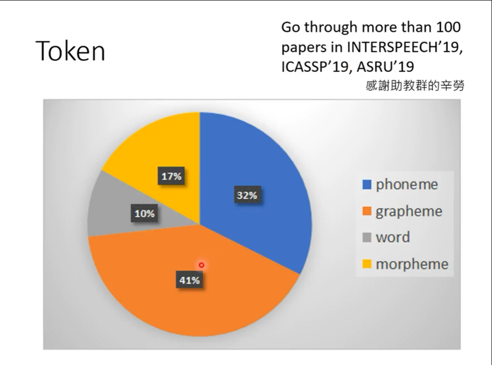

# 课程一：初见Speech Recognition
语音模型：即将 **sound** 转换成 **text**

* **Text:** a sequence of Token
  * 长度：**N** ， 总种类数量：**V**
* **Sound:** vectors sequence
  * 长度：**T** ， 总种类数量：**d**
---

## 一、Text Token
**种类**
1. Phoneme：即 a unit of sound，可以理解为发音的音标
2. Grapheme：即 smallest unit of a writting，比如【26个英文字母+空格+标点符号】
3. Word：即语言中的单词
4. Morpheme：即 smallest meaningful unit，比如英语单词的词根
5. Bytes：直接用字节表示一组Text，常见的诸如 UTF-8 编码
   
**大家用的（大趋势）**

最多的是grapheme，这种非常简单直接。

## 二、模型（Speech Recognition）功能
1. 输出 word embeddings
2. 模型中加入 Translation，输出识别后翻译的结果
3. 模型中加入 Intent classification，输出语音的分类，理解对方意图
4. 模型中加入 Slot filling，即输出一段语句的关键词，如时间、地点等
---

## 三、声音特征 Acoustic Feature
通常以 25ms 为窗口长度，将声音讯号转为 一个向量（**frame**，也即帧），每次窗口移动 10ms，也就
是说 1s →100 frames
![图片2]（）

